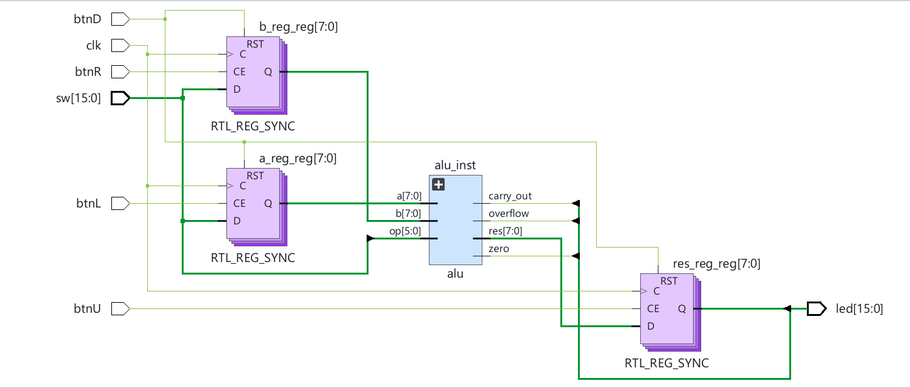
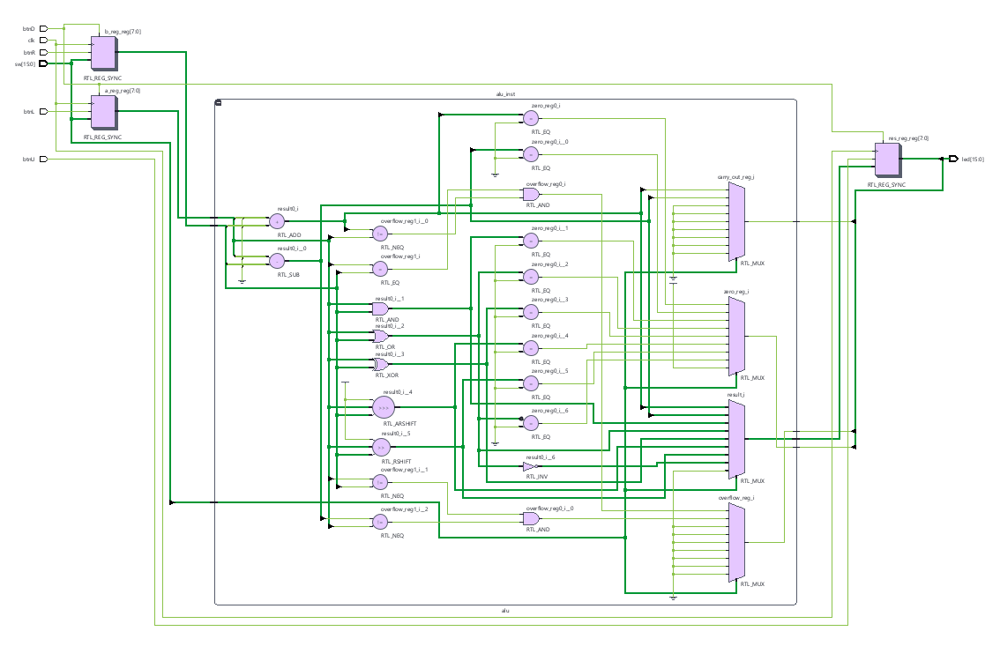

# Diseño de una unidad aritmético-lógica en Verilog para Basys 3

En este trabajo desarrollamos una unidad aritmético-lógica (ALU) en Verilog, con la placa Basys 3 como plataforma de destino. El objetivo fue integrar operaciones aritméticas, lógicas y de desplazamiento en un módulo reutilizable, e incorporar una interfaz que permita cargar operandos y visualizar resultados mediante los recursos de la placa. El desarrollo vincula conceptos de arquitectura de computadoras, representación binaria y diseño digital mediante una descripción de hardware sintetizable.

El proyecto se organiza en tres archivos dentro de `src`: `alu.v`, que describe el núcleo de cálculo; `basys3_top.v`, que integra la ALU con registros y controles externos; y `alu_testbench.v`, que contiene los estímulos y las comprobaciones de simulación. Por su parte, `constrains/basys3.xdc` define la asignación de pines, el estándar eléctrico y la restricción de reloj. Esta separación permite analizar el procesamiento, la interacción con la placa y la verificación de manera independiente.

La ALU recibe dos operandos, `a` y `b`, y un código de operación, `op`. Entrega un resultado, `res`, y tres indicadores de estado: `zero`, `overflow` y `carry_out`. El ancho de datos se establece mediante el parámetro `N_DATA`, cuyo valor predeterminado es de 8 bits. El código de operación utiliza `N_OP`, definido inicialmente en 6 bits. Aunque el núcleo admite parametrización, la integración con los interruptores y LED está planteada para la configuración de 8 bits.

La selección de operaciones se realiza mediante una estructura `case` dentro de un bloque `always @(*)`. El resultado se actualiza en función de las entradas, sin requerir un reloj en el núcleo de cálculo. Las operaciones implementadas son las siguientes:

| Operación | Código | Función |
|---|---|---|
| ADD | `100000` | Suma de los operandos. |
| SUB | `100010` | Resta de `b` a `a`. |
| AND | `100100` | Conjunción bit a bit. |
| OR | `100101` | Disyunción bit a bit. |
| XOR | `100110` | Disyunción exclusiva bit a bit. |
| NOR | `100111` | Negación de la disyunción bit a bit. |
| SRA | `000011` | Desplazamiento aritmético a la derecha. |
| SRL | `000010` | Desplazamiento lógico a la derecha. |

En ambos desplazamientos, `b` indica la cantidad de posiciones. SRL introduce ceros por la izquierda, mientras que SRA conserva el signo mediante la conversión `$signed(a)`. Con 8 bits, el resultado mantiene los ocho bits menos significativos de las operaciones aritméticas. Ante un código no reconocido, se establece un resultado nulo y se activa `zero`.

La bandera `zero` indica que el resultado es cero. `overflow` detecta desbordamiento en la interpretación con signo, en complemento a dos: en la suma se verifica si operandos del mismo signo producen un resultado de signo distinto; en la resta, si los operandos tienen signos diferentes y el resultado cambia respecto del signo de `a`. `carry_out` recoge el bit adicional de la operación extendida. En la resta implementada, este bit indica préstamo cuando `a` es menor que `b` en la interpretación sin signo. Acarreo y desbordamiento son condiciones diferentes y deben evaluarse por separado.

La integración con la placa utiliza registros para conservar ambos operandos y el resultado. Su actualización ocurre en el flanco ascendente de `clk`. El botón izquierdo carga `a_reg` desde `sw[7:0]`, y el derecho carga `b_reg` desde los mismos interruptores. Luego se selecciona la operación mediante `sw[5:0]` y se utiliza el botón superior para almacenar el resultado en `res_reg`. El botón inferior pone en cero los tres registros de forma sincrónica y tiene prioridad cuando coincide con otras acciones. Los botones se evalúan por nivel: mientras permanecen presionados, la carga se repite en cada ciclo.

El resultado almacenado se presenta en `led[7:0]`. Los LED 15, 14 y 13 muestran, respectivamente, `zero`, `overflow` y `carry_out`. Estas banderas se conectan directamente a la ALU, por lo que pueden cambiar al modificar el código de operación aunque el resultado visible continúe almacenado. Los LED 8 a 12 no tienen una asignación explícita en el módulo superior.

El archivo XDC vincula los puertos con los pines de los 16 interruptores, los cuatro botones utilizados y los 16 LED. Configura las señales con el estándar `LVCMOS33` y asigna el reloj al pin W5. Además, declara un período de 10 ns, equivalente a 100 MHz. Esta restricción establece el objetivo temporal para las herramientas de implementación; por sí sola no demuestra que el diseño cumpla temporización.

Para verificar el núcleo se preparó un banco de pruebas con 14 casos dirigidos, que abarcan las ocho operaciones y situaciones de resultado cero, acarreo, préstamo y desbordamiento. Cada caso aplica entradas, espera 10 unidades de tiempo y compara las salidas con los valores esperados. El indicador `fails` se inicializa en cero y se activa si alguna comparación falla.

Además de la verificación planteada mediante el banco de pruebas, el diseño se llevó a Vivado para realizar el proceso de síntesis e implementación y generar el archivo de programación. Posteriormente, se cargó el diseño en una FPGA Basys 3 y se efectuaron pruebas prácticas utilizando los interruptores para ingresar los operandos y seleccionar las operaciones, los botones para almacenar los datos y los LED para observar los resultados y las banderas. Durante estas pruebas, la ALU respondió correctamente y se comprobó el funcionamiento esperado del sistema completo en hardware.

## Esquemas RTL obtenidos en Vivado

La Figura 1 muestra el esquema general elaborado por Vivado a partir del módulo superior `basys3_top`. Se observan los registros de 8 bits destinados a almacenar los operandos `a` y `b`, el bloque correspondiente a la ALU y el registro que conserva el resultado. También aparecen las entradas físicas de la placa —reloj, interruptores y botones— y la conexión de las salidas hacia los LED. Este esquema permite verificar la integración entre el circuito combinacional de cálculo y los elementos secuenciales controlados por el reloj.

*Figura 1. Esquema RTL general del módulo `basys3_top` generado por Vivado.*

La Figura 2 presenta una vista expandida del bloque `alu_inst`. En ella se distinguen los recursos empleados para implementar las operaciones de suma, resta, AND, OR, XOR, NOR y los desplazamientos. Los multiplexores seleccionan el resultado y las banderas correspondientes según el código `op[5:0]`. La imagen muestra cómo la descripción mediante la estructura `case` fue traducida por Vivado a bloques lógicos interconectados.

*Figura 2. Esquema RTL interno de la ALU, con sus operaciones y circuitos de selección.*

En el núcleo, `overflow_reg` y `carry_out_reg` se inicializan en cero al comienzo del bloque combinacional y se actualizan cuando corresponde en las operaciones aritméticas. De esta manera, las operaciones lógicas y de desplazamiento no conservan banderas generadas por una operación anterior y se evita la inferencia de latches. Como mejoras de integración, se plantea sincronizar las entradas externas, incorporar tratamiento del rebote de los botones y registrar las banderas junto con el resultado si se busca una visualización consistente.

El trabajo permitió implementar y validar una ALU de 8 bits, desde su descripción en Verilog hasta su funcionamiento sobre una FPGA. La organización modular facilitó la integración entre el núcleo de cálculo, la interfaz de la Basys 3 y las restricciones físicas del dispositivo. Las pruebas realizadas en la placa confirmaron que los operandos pueden cargarse correctamente, que las operaciones seleccionadas producen los resultados previstos y que las salidas se visualizan mediante los LED. De esta forma, se alcanzó el objetivo de desarrollar un sistema digital funcional y comprobar su comportamiento en hardware real.
